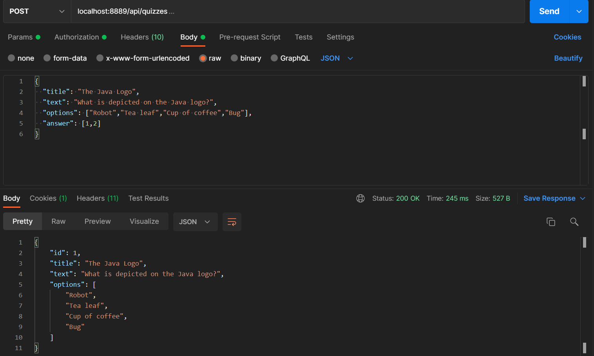
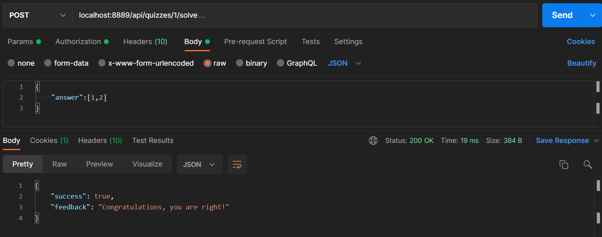
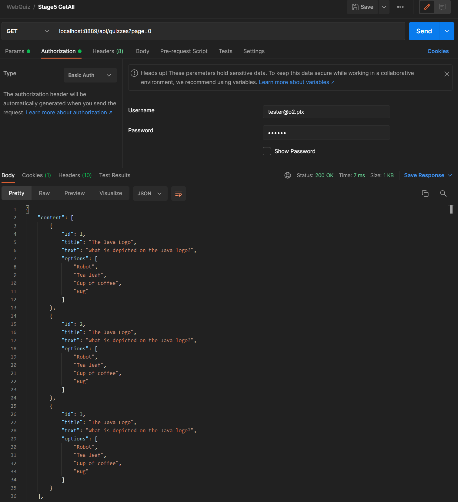
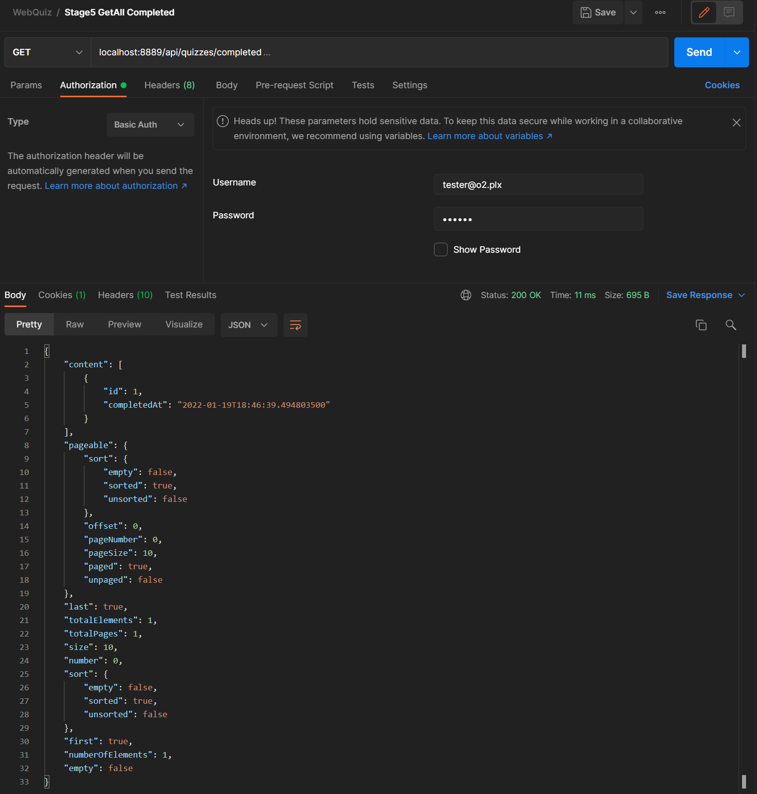
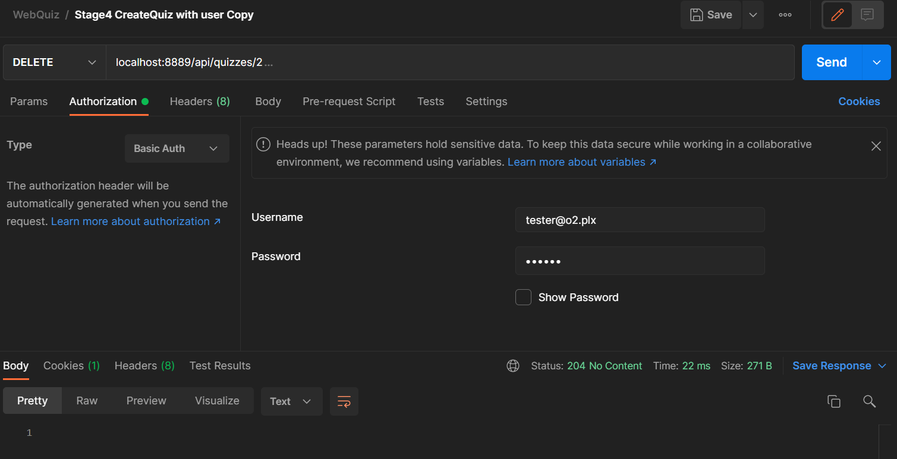

# Recipes Rest App
Restful Web Quiz - JetBrains Academy Project.

## About
Quiz type web application project. The project uses the HTTP protocol (requests and responses) to communicate with the user. The user has the function of registering on the website. A registered user can add new questions (which are saved in the database), as well as answer questions from all other users. All successive solutions are saved in the database.

## Tech
- Java
- Spring Framework
- Spring Security
- Hibernate
- H2 Database
- Json
- Lombok

## Illustrations

### Register user

### Create quiz

### Solve quiz

### GetAll quiz

### GetSolved quiz

### Delete quiz

